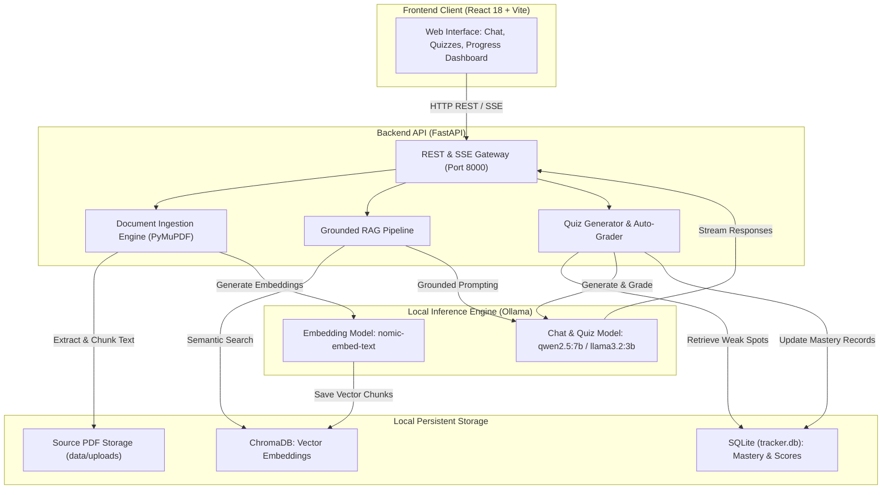

# Gist

Gist is an offline, privacy-first AI study partner powered by local large language models (LLMs) via Ollama, FastAPI, and React. It transforms course documents into an interactive, locally hosted learning environment with grounded Q&A, source citations, adaptive quizzes, and longitudinal mastery tracking.

---

## Architecture Overview



---

## Key Capabilities

- **100% Offline & Private**: All document processing, vector search, and model inference run locally on-device. No data, documents, or telemetry leave the host system.
- **Page-Aware Document Ingestion**: Parses course PDFs with PyMuPDF, preserving exact page numbers and chunking text with semantic overlap.
- **Grounded Q&A with Strict Citations**: Uses similarity search in ChromaDB to retrieve relevant context. Constrained system prompts prevent hallucinations and provide page-level citations (for example, `[Source: lecture1.pdf, Page: 4]`).
- **Adaptive Quizzes & Automated Grading**: Generates structured multiple-choice and conceptual short-answer questions tailored to specific topics or historical weak spots.
- **Mastery & Weak-Spot Tracking**: Automatically logs quiz results in SQLite, computes rolling mastery scores per topic, and prioritizes revision areas.
- **Dynamic Model Selection**: Allows runtime switching between installed local Ollama models (such as `qwen2.5:7b` and `llama3.2:3b`) without server restarts.

---

## Technical Stack

| Component | Technology | Purpose |
| --- | --- | --- |
| **Frontend** | React 18, TypeScript, Vite, Tailwind CSS, Lucide Icons | Responsive interactive user interface |
| **Backend** | FastAPI, Python 3.10+, Uvicorn, Pydantic | REST API and Server-Sent Events (SSE) streaming |
| **PDF Extraction** | PyMuPDF (`fitz`) | Page-aware document text extraction |
| **Vector Database** | ChromaDB | Persistent local dense vector indexing and cosine retrieval |
| **Relational Database** | SQLite (`data/tracker.db`) | Quiz history, score logs, and rolling mastery metrics |
| **Local LLM Runtime** | Ollama | Local model execution (`qwen2.5:7b`, `nomic-embed-text`) |

---

## Quick Start Guide

### Prerequisites

- **Ollama**: Installed and running locally (`http://localhost:11434`). Download from [ollama.com](https://ollama.com).
- **Python**: 3.10 or higher.
- **Node.js**: 18.x or higher and `npm`.

### 1. Pull Local Models

```bash
# Pull the default chat LLM and embedding model
ollama pull qwen2.5:7b
ollama pull nomic-embed-text:latest

# Optional: lightweight model for 8 GB RAM machines
ollama pull llama3.2:3b
```

### 2. Launch Backend

```bash
# Create and activate virtual environment
python3 -m venv .venv
source .venv/bin/activate

# Install dependencies
pip install fastapi uvicorn pymupdf chromadb sqlite3 pydantic ollama

# Start the FastAPI server
uvicorn backend.main:app --reload --port 8000
```

Verify backend health at `http://localhost:8000/health`.

### 3. Launch Frontend

```bash
cd frontend
npm install
npm run dev
```

Open `http://localhost:5173` in your browser.

---

## API Summary

| Method | Endpoint | Description |
| --- | --- | --- |
| `GET` | `/health` | Verifies backend status, storage paths, and Ollama connection |
| `GET` | `/models` | Lists installed Ollama models and indicates the active model |
| `POST` | `/models/select` | Dynamically switches the active chat model |
| `POST` | `/warmup` | Pre-loads models into RAM/VRAM to reduce first-query latency |
| `POST` | `/upload` | Ingests and indexes PDF documents into ChromaDB |
| `GET` | `/documents` | Lists all indexed PDF documents with chunk and page counts |
| `DELETE` | `/documents/{source}` | Removes a specific document and its vector chunks |
| `DELETE` | `/subjects/{topic}` | Removes all documents and tracking data for a subject |
| `POST` | `/ask` | Synchronous grounded Q&A against indexed context |
| `POST` | `/ask/stream` | Streamed token response via Server-Sent Events (SSE) |
| `POST` | `/quiz/generate` | Generates structured MCQs and short-answer questions |
| `POST` | `/quiz/submit` | Evaluates student answers and updates topic mastery |
| `GET` | `/progress` | Retrieves overall mastery metrics and weak spots |
| `GET` | `/topics` | Retrieves score statistics grouped by topic |
| `POST` | `/reset` | Resets vector collections and/or mastery tracking tables |

---

## Documentation Index

Comprehensive documentation following the Diátaxis framework is available in the [`docs/`](docs/README.md) directory:

- **[Getting Started Tutorial](docs/getting-started.md)**: Step-by-step onboarding lesson for setup and verification.
- **[How-To Guides](docs/how-to-guides.md)**: Actionable recipes for operational tasks, model switching, and troubleshooting.
- **[Architecture & Design](docs/architecture.md)**: Deep dive into the offline-first privacy model, RAG mechanics, and scoring math.
- **[API Reference](docs/api-reference.md)**: Complete endpoint specifications, request payloads, and response formats.
- **[Configuration Reference](docs/configuration.md)**: Environment variables, runtime parameters, and model precedence rules.
