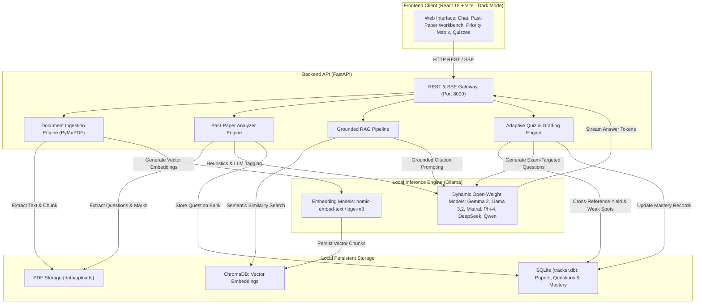

# Gist (Exam Buddy)

Gist is an offline, privacy-first AI study partner powered by local open-weight large language models (LLMs) via Ollama, FastAPI, and React. It combines page-grounded document Q&A with an exam intelligence engine that analyzes past question papers, detects topic marks weightages, and prioritizes high-yield weak spots.

---

## Architecture Overview



---

## Dynamic Open-Weight Model Support

Gist is model-agnostic and discovers installed models in your local Ollama environment at runtime. You can switch models on the fly through the UI or REST API without restarting the server.

Recommended open-weight models include:

- **Google Gemma 2** (`gemma2:9b`, `gemma2:2b`): First-class recommendation for exceptional reasoning, strong factual recall, and low latency. The `2b` variant offers full capabilities on 8 GB RAM machines.
- **Meta Llama** (`llama3.2:3b`, `llama3.2:1b`, `llama3.1:8b`): High-efficiency conversational models optimized for resource-constrained environments.
- **Mistral** (`mistral:7b`, `mistral-nemo`): Excellent balanced performance for technical and conceptual explanations.
- **Microsoft Phi** (`phi4`, `phi3.5`): Highly capable compact models for mathematical and logical reasoning.
- **DeepSeek** (`deepseek-r1:8b`, `deepseek-r1:7b`): Open-weight reasoning models for step-by-step problem derivation.
- **Qwen** (`qwen2.5:7b`, `qwen2.5:14b`): Multilingual and coding-capable open models.
- **Embedding Models**: Native support for `nomic-embed-text`, `bge-m3`, `bge-large`, and `mxbai-embed-large`.

---

## Key Capabilities

- **100% Offline & Private**: All document processing, vector search, question extraction, and LLM inference execute on your local device. Zero data, documents, or telemetry leave your system.
- **Dual-Engine Learning**:
  - *Study Note RAG*: Ingest lecture notes and textbooks with page-level citation accountability (`[Source: lecture1.pdf, Page: 4]`).
  - *Past-Paper Exam Intelligence*: Upload previous years' exam papers (PDFs) to automatically extract questions, detect marks allocations, and compute historical topic frequencies.
- **Exam Priority Matrix**: Automatically cross-references past exam weightages against your quiz performance to pinpoint **High-Yield Weak Spots**—topics worth significant exam marks where your mastery is lowest.
- **Subject Segregation**: Separate notes, past papers, questions, and mastery statistics by academic subject (for example, *DBMS*, *Operating Systems*, *Mathematics*).
- **Adaptive Quizzing & Grading**: Generate multiple-choice and conceptual short-answer quizzes targeted at specific topics, general weak spots, or high-yield exam patterns, with instant automated grading.
- **Dark-Theme Interactive Workbench**: Polished, low-distraction user interface featuring a diagnostic quiz workbench, question browser, and progress analytics.

---

## Technical Stack

| Component | Technology | Purpose |
| --- | --- | --- |
| **Frontend** | React 18, TypeScript, Vite, Tailwind CSS, Lucide Icons | Dark-mode interface, question browser, priority matrix visualizer |
| **Backend** | FastAPI, Python 3.10+, Uvicorn, Pydantic | REST API and Server-Sent Events (SSE) streaming gateway |
| **PDF Extraction** | PyMuPDF (`fitz`) | Fast, page-aware text and exam paper extraction |
| **Vector Database** | ChromaDB | Persistent local dense vector store for similarity retrieval |
| **Relational Database** | SQLite (`data/tracker.db`) | Question bank, past papers, attempt metrics, and topic mastery |
| **Local LLM Runtime** | Ollama | Dynamic execution of Gemma 2, Llama 3.2, Mistral, and other models |

---

## Quick Start Guide

### Prerequisites

- **Ollama**: Installed and running locally (`http://localhost:11434`). Download from [ollama.com](https://ollama.com).
- **Python**: Version `3.10` or higher.
- **Node.js**: Version `18.x` or higher and `npm`.

### 1. Pull Open-Weight Models via Ollama

Download your preferred chat model (Google Gemma 2 recommended) and embedding model:

```bash
# Recommended primary chat model (Google Gemma 2)
ollama pull gemma2:9b

# Lightweight chat model option for 8 GB RAM systems
ollama pull gemma2:2b

# Vector embedding model
ollama pull nomic-embed-text:latest
```

### 2. Launch Backend

```bash
# Clone and enter directory
cd gist

# Create and activate virtual environment
python3 -m venv .venv
source .venv/bin/activate

# Install dependencies
pip install fastapi uvicorn pymupdf chromadb sqlite3 pydantic ollama

# Start the FastAPI server
uvicorn backend.main:app --reload --port 8000
```

Verify backend health at `http://localhost:8000/health`.

### 3. Launch Frontend

```bash
cd frontend
npm install
npm run dev
```

Open `http://localhost:5173` in your browser.

---

## API Summary

| Method | Endpoint | Description |
| --- | --- | --- |
| `GET` | `/health` | Verifies backend status, storage paths, and Ollama connection |
| `GET` | `/models` | Lists installed Ollama models and highlights active model |
| `POST` | `/models/select` | Dynamically switches the active chat model (Gemma, Llama, etc.) |
| `POST` | `/warmup` | Pre-loads models into RAM/VRAM to eliminate initial query latency |
| `POST` | `/upload` | Ingests and indexes lecture notes / PDFs into ChromaDB |
| `GET` | `/documents` | Lists indexed course material files with chunk counts |
| `DELETE` | `/documents/{source}` | Deletes a document and its vector chunks |
| `DELETE` | `/subjects/{topic}` | Deletes all course documents and tracking records for a subject |
| `POST` | `/ask` | Synchronous grounded Q&A against course materials |
| `POST` | `/ask/stream` | Streamed token response via Server-Sent Events (SSE) |
| `POST` | `/quiz/generate` | Generates quizzes (supports `use_weak_spots` and `use_high_yield`) |
| `POST` | `/quiz/submit` | Evaluates student answers and logs topic mastery |
| `GET` | `/progress` | Retrieves overall progress, average scores, and weak spots |
| `GET` | `/topics` | Retrieves score statistics grouped by topic |
| `POST` | `/past-papers/upload` | Extracts questions, marks, and topics from past exam PDFs |
| `GET` | `/past-papers` | Lists uploaded past papers (supports subject filtering) |
| `GET` | `/past-papers/subjects`| Lists distinct subjects across uploaded past papers |
| `GET` | `/past-papers/analysis`| Aggregates topic frequency, marks weightage, and yield ratings |
| `GET` | `/past-papers/priority-matrix` | Exam Priority Matrix: intersects high-yield topics with weak spots |
| `GET` | `/past-papers/questions` | Filterable question bank with topic, year, marks, and search |
| `POST` | `/past-papers/reanalyze` | Re-runs question extraction and tagging across stored papers |
| `POST` | `/reset` | Granular reset for vector index, quiz tracking, or past papers |

---

## Documentation Index

Comprehensive documentation is available in the [`docs/`](docs/README.md) directory:

- **[Getting Started Tutorial](docs/getting-started.md)**: Step-by-step onboarding lesson for setup and verification.
- **[How-To Guides](docs/how-to-guides.md)**: Actionable recipes for operational tasks, model switching, and troubleshooting.
- **[Architecture & Design](docs/architecture.md)**: Deep dive into the offline-first privacy model, dual-engine RAG and exam analyzer, and scoring math.
- **[API Reference](docs/api-reference.md)**: Complete endpoint specifications, request payloads, and response formats.
- **[Configuration Reference](docs/configuration.md)**: Environment variables, runtime parameters, and dynamic model discovery rules.

---

## License

This project is licensed under the MIT License - see the [LICENSE](LICENSE) file for details.
