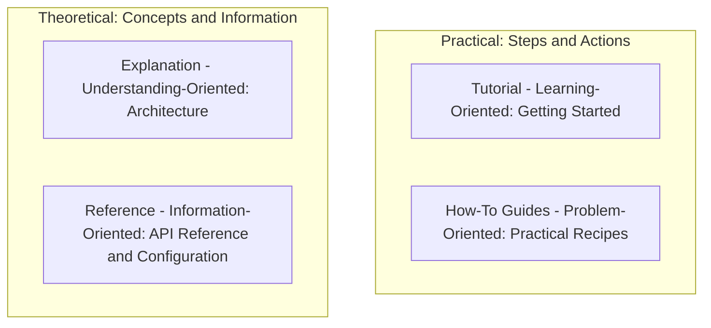

# Gist Documentation Hub

Welcome to the documentation hub for **Gist** (Exam Buddy) — an offline, privacy-first AI study partner powered by local open-weight LLMs via [Ollama](https://ollama.com).

Our documentation is structured according to the [Diátaxis Framework](https://diataxis.fr/), separating content into four distinct categories based on your immediate need.

---

## Documentation Quadrants

---

### 1. Tutorial (Learning-Oriented)
Guides you step-by-step to get a fully working Gist environment running locally with open-weight models.
- **[Getting Started](getting-started.md)**: Install Ollama models (featuring Google Gemma 2), set up the FastAPI backend, launch the React frontend, ingest lecture notes, upload a past paper, and run your first exam-targeted mock session.

### 2. How-To Guides (Problem-Oriented)
Practical recipes to complete specific tasks and handle administrative operations.
- **[How-To Guides](how-to-guides.md)**:
  - How to dynamically switch between Gemma, Llama, Mistral, and other open-weight models
  - How to run timed Mock Exam simulations ("Grill Me" mode)
  - How to use Fast Mode for instant question generation (<100ms)
  - How to upload and analyze past exam question papers
  - How to inspect past quiz attempts and topic history
  - How to interpret and act on the Exam Priority Matrix
  - How to isolate study materials using subject segregation
  - How to perform granular data resets (vector DB, quiz tracker, or past papers)
  - How to troubleshoot Ollama connection and performance issues

### 3. Reference (Information-Oriented)
Technical specs, API schemas, and configuration parameters.
- **[API Reference](api-reference.md)**: Comprehensive specs for all FastAPI REST endpoints, mock exam routes, past-paper analysis routes, payload schemas, and status codes.
- **[Configuration Reference](configuration.md)**: Complete guide to environment variables, system defaults, directory paths, and dynamic model discovery precedence.

### 4. Explanation (Understanding-Oriented)
Architectural rationale, system mechanics, and theoretical background.
- **[Architecture & Design](architecture.md)**: Explains the offline-first privacy model, dual-engine learning system (Grounded Note RAG + Past-Paper Intelligence), mock exam simulation mechanics, and the High-Yield Priority Matrix calculation formulas.

---

## Feature Matrix

| Feature | System Component | Description |
| --- | --- | --- |
| **Document Ingestion** | PyMuPDF + ChromaDB | Parses course material PDFs page-by-page, chunks text, and stores embeddings locally via `nomic-embed-text` or `bge-m3`. |
| **Past-Paper Analyzer** | Regex + LLM Heuristics + SQLite | Extracts questions, detects marks allocations, tags academic topics, and categorizes exam yield ratings. |
| **Exam Priority Matrix** | SQLite Analytics Engine | Cross-references past-paper marks distribution against quiz mastery to spotlight High-Yield Weak Spots. |
| **Mock Exam Simulator** | Timer + Multi-Mark LLM Evaluator | High-stakes timed exam simulations ("Grill Me" mode) with mark weightings, countdowns, and topic score breakdowns. |
| **Adaptive Quizzes** | Ollama LLM + SQLite | Generates structured MCQs and short-answer questions with instant bank (<100ms) and AI authoring modes. |
| **Attempt Review System**| SQLite Question Logs | Revisit any past quiz attempt with full question prompts, student submissions, and examiner feedback. |
| **Subject Segregation** | Multi-Subject Filter | Isolates lecture notes, past papers, questions, and mastery statistics by academic subject. |
| **Dynamic Model Selection**| Runtime Model Resolver | Discovers and switches between installed Ollama models (Gemma 2, Llama 3.2, Mistral, Phi-4, DeepSeek, Qwen) without restarts. |
