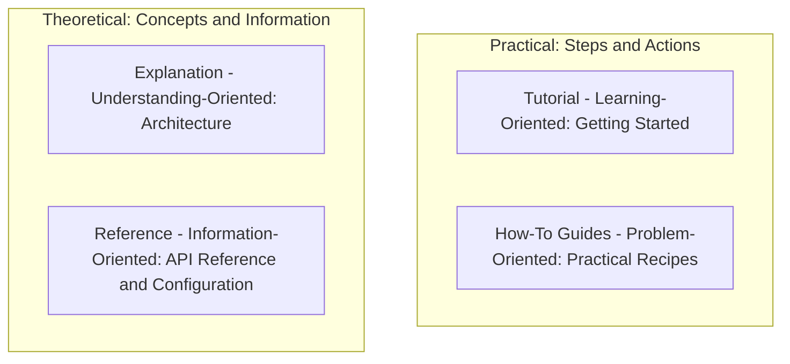

# Gist Documentation Hub

Welcome to the documentation hub for **Gist** (Exam Buddy) — an offline, privacy-first AI study assistant powered by local LLMs via [Ollama](https://ollama.com).

Our documentation is structured according to the [Diátaxis Framework](https://diataxis.fr/), separating content into four distinct categories based on your immediate need.

---

## Documentation Quadrants

---

### 1. Tutorial (Learning-Oriented)
Guides you step-by-step to get a fully working Gist environment running locally.
- **[Getting Started](getting-started.md)**: Install Ollama models, set up the FastAPI backend, launch the React frontend, and complete your first RAG query.

### 2. How-To Guides (Problem-Oriented)
Practical recipes to complete specific tasks and handle administrative operations.
- **[How-To Guides](how-to-guides.md)**:
  - How to switch active LLM models on the fly
  - How to manage document subjects and vector collections
  - How to reset mastery tracking data
  - How to configure custom chunking and temperature parameters
  - How to troubleshoot Ollama connection and performance issues

### 3. Reference (Information-Oriented)
Technical specs, API schemas, and configuration parameters.
- **[API Reference](api-reference.md)**: Comprehensive specs for all FastAPI REST endpoints, SSE streams, payload schemas, and status codes.
- **[Configuration Reference](configuration.md)**: Complete guide to environment variables, system defaults, directory paths, and model persistence hierarchy.

### 4. Explanation (Understanding-Oriented)
Architectural rationale, system mechanics, and theoretical background.
- **[Architecture & Design](architecture.md)**: Explains the offline-first privacy model, PyMuPDF chunking pipeline, ChromaDB RAG retrieval mechanics, and SQLite quiz mastery scoring formulas.

---

## Feature Matrix

| Feature | System Component | Description |
| --- | --- | --- |
| **Document Ingestion** | PyMuPDF + ChromaDB | Parses course material PDFs page-by-page, chunks text, and stores embeddings locally via `nomic-embed-text`. |
| **Grounded Q&A** | RAG Pipeline + SSE | Streamed AI answers backed strictly by uploaded context with page-level source citations. |
| **Adaptive Quizzes** | Ollama LLM + SQLite | Generates structured MCQs and short-answer questions targeted at designated topics or weak spots. |
| **Mastery Tracking** | SQLite Database | Tracks quiz accuracy over time and calculates topic mastery to focus future revision. |
| **Model Selection** | Runtime Switcher | Switch dynamically between installed Ollama models (`qwen2.5:7b`, `llama3.2:3b`, etc.). |
