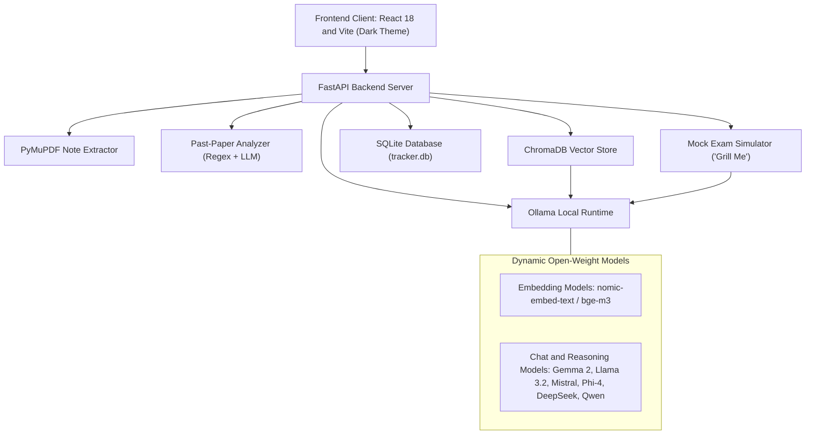
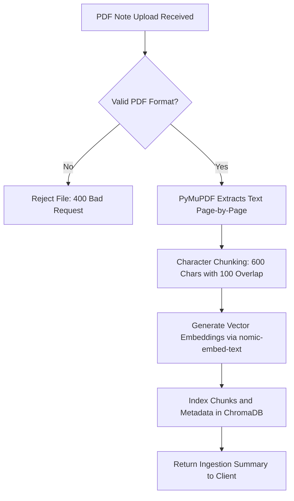
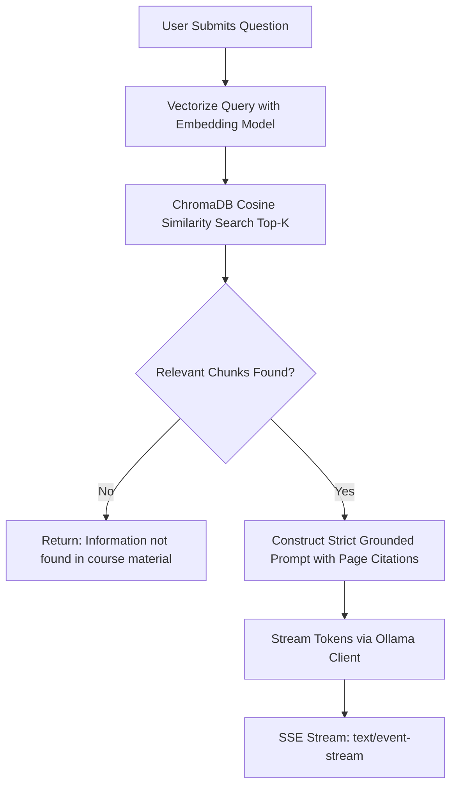
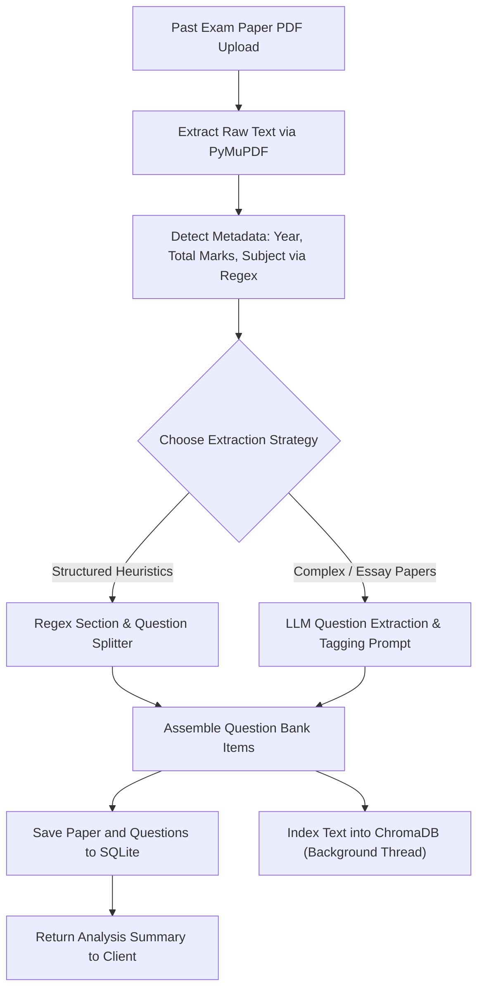
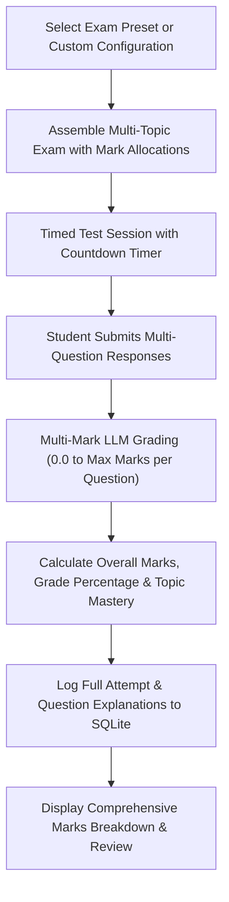
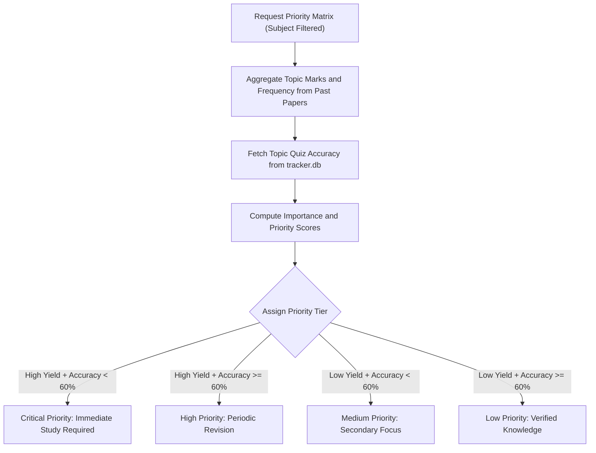

# System Architecture & Design Concepts

This document provides a conceptual explanation of **Gist** (Exam Buddy), detailing its dual-engine architecture, data flow mechanics, retrieval-augmented generation (RAG) design, past-paper intelligence, mock exam simulation, and exam priority formulas.

---

## Guiding Design Principles

### 1. Privacy-First & 100% Offline
Gist runs entirely on the host machine. All AI inference, vector embedding, and document processing happen locally via Ollama, PyMuPDF, ChromaDB, and SQLite. Zero data, telemetry, or document text leaves your machine.

### 2. Dual-Engine Learning Architecture
Unlike standard RAG tools that only answer user questions from notes, Gist couples **Course Note Grounding** with **Exam Intelligence & Simulation**:
- **Engine 1 (Note RAG)**: Answers questions with strict page-level citations (`[Source: document.pdf, Page: N]`).
- **Engine 2 (Past-Paper Analyzer, Priority Matrix & Mock Exam Simulator)**: Extracts recurring question patterns, determines topic marks weightages, and conducts timed multi-mark examinations ("Grill Me" mode).

### 3. Strict Hallucination Prevention
For academic study and exam preparation, inaccurate information is harmful. Gist uses strict system prompts combined with low generation temperatures ($T = 0.2$) to enforce factual grounding. If retrieved document chunks do not contain sufficient context to answer a question, the system explicitly admits missing information rather than generating speculative answers.

### 4. Dynamic Model Agility
Gist does not hardcode any single model architecture. It supports open-weight models dynamically through Ollama, prioritizing **Google Gemma 2** (`gemma2:9b`, `gemma2:2b`), followed by **Meta Llama 3.2**, **Mistral**, **Microsoft Phi-4**, **DeepSeek-R1**, and **Qwen 2.5**.

---

## Technical Stack Overview



---

## Core Pipeline Mechanics

### 1. Course Note Ingestion Pipeline



1. **Page Extraction**: PyMuPDF (`fitz`) parses the raw PDF page by page, preserving page index numbers.
2. **Text Chunking**: Text from each page is split into overlapping chunks (600 characters per chunk with 100 characters overlap) to preserve semantic boundaries across chunk splits.
3. **Embedding Generation**: Chunks are embedded into dense vector embeddings via local models (`nomic-embed-text` or `bge-m3`).
4. **Vector Persistence**: Embeddings and chunk text are stored in ChromaDB alongside metadata: `source` (filename), `page` number, and `topic`.

---

### 2. Grounded RAG Q&A Pipeline



1. **Query Embed**: The user's question is embedded into the vector space.
2. **Similarity Search**: ChromaDB retrieves the top $K$ ($K=3$ by default) most relevant chunks based on vector distance, optionally filtered by `topic` or `source`.
3. **Context Construction**: Chunks are assembled into a structured prompt containing source citations:
   ```text
   Context:
   ---
   [Source: lecture1.pdf, Page: 5]
   Backpropagation calculates the gradient of the loss function with respect to each weight...
   ---
   Question: Explain backpropagation.
   ```
4. **Streamed Generation**: The active LLM generates the answer, streaming tokens to the client via Server-Sent Events (`text/event-stream`).

---

### 3. Past-Paper Analysis & Question Extraction Pipeline



- **Regex Heuristics**: Detects exam metadata (`Max Marks`, `Total: 100`, year patterns `2018-2026`) and splits questions based on standard patterns (`Q1(a)`, `2. Describe...`, `[10 Marks]`).
- **LLM Concept Classifier**: Analyzes the question text to tag the exact syllabus subtopic (for example, *Normalization*, *B-Trees*, *Deadlocks*).
- **Background Vectorization**: Indexes question text into ChromaDB so that past exam questions can be retrieved during regular Q&A.

---

### 4. Mock Exam Simulation & Multi-Mark Evaluation



- **Mark Budgets**: Each question carries specific marks (e.g. 2 marks for definitions, 5 marks for explanations, 10 marks for comprehensive derivations).
- **Conceptual Multi-Mark Grading**: The LLM evaluates multi-mark short and long answers against a strict grading rubric, assigning continuous partial marks ($0.0 \dots \text{Max Marks}$) with itemized feedback.
- **Persistent Attempt Logs**: All questions, student answers, and grading remarks are archived in SQLite (`tracker.db`) for retrospective review (`/quiz/attempts/{quiz_id}`).

---

### 5. Exam Priority Matrix & Mastery Calculation



#### Mathematical Formulas

1. **Rolling Topic Mastery**:
   Mastery for topic $T$ is computed as an exponentially weighted rolling score of recent attempt accuracies $A_i$:
   $$\text{Mastery}(T) = \frac{\sum_{i=1}^n w_i \cdot A_i}{\sum_{i=1}^n w_i}$$
   where more recent quiz attempts receive higher weights $w_i$.

2. **Exam Importance Score**:
   Measures how heavily an academic topic features across historical exams:
   $$\text{ExamImportance}(T) = \text{MarksSharePct}(T) \times \left(0.7 + 0.3 \times \frac{\text{FrequencyPct}(T)}{100}\right)$$

3. **Combined Priority Score**:
   Balances exam weight against the student's mastery deficit:
   $$\text{PriorityScore}(T) = 0.6 \times \text{ExamImportance}(T) + 0.4 \times (100 - \text{Mastery}(T))$$
   Topics with $\text{PriorityScore} \ge 70$ and $\text{Mastery} < 60\%$ are categorized as **Critical Priority** (High-Yield Weak Spots).

---

## Storage Directory Layout

```
data/
├── chroma/           # ChromaDB persistent vector database files
├── tracker.db        # SQLite database (papers, question bank, attempt logs, and mastery scores)
├── uploads/          # Original course PDFs and past question papers
└── model_config.json # Persisted active model selection across restarts
```
