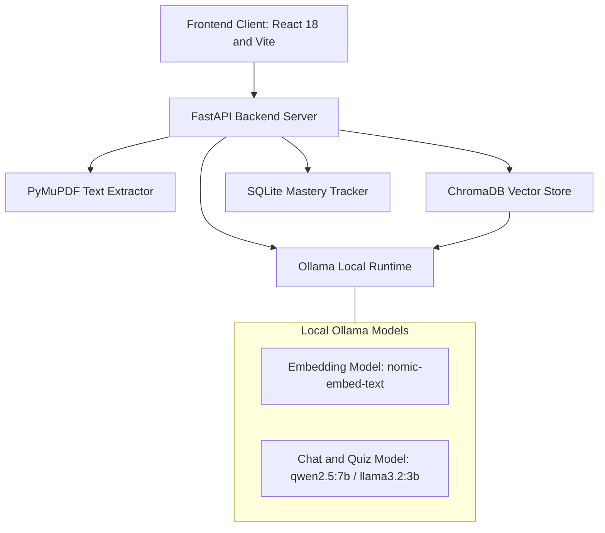
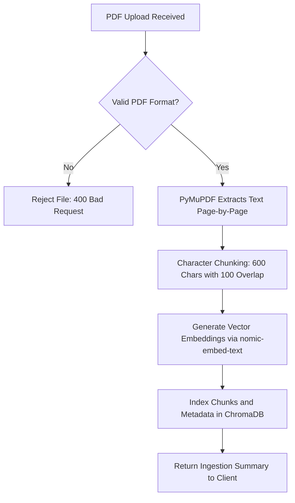
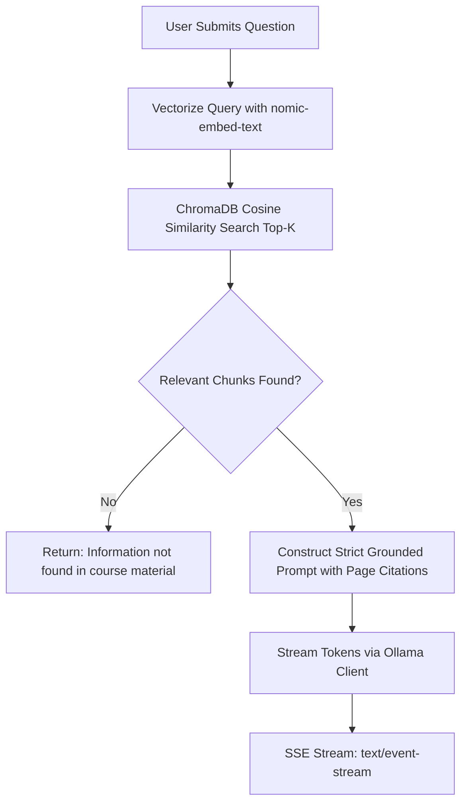
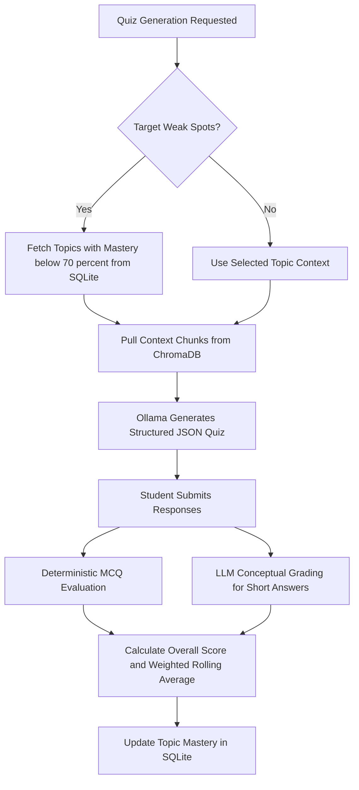

# System Architecture & Design Concepts

This document provides a conceptual explanation of **Gist** (Exam Buddy), detailing its design philosophy, data flow mechanics, retrieval-augmented generation (RAG) architecture, and mastery calculation logic.

---

## Guiding Design Principles

### 1. Privacy-First & 100% Offline
Gist runs entirely on the host machine. All AI inference, vector embedding, and document processing happen locally via Ollama, PyMuPDF, ChromaDB, and SQLite. Zero data, telemetry, or document text leaves your machine.

### 2. Strict Hallucination Prevention
For academic study and exam preparation, inaccurate information is harmful. Gist uses strict system prompts combined with low generation temperatures ($T = 0.2$) to enforce factual grounding. If retrieved document chunks do not contain sufficient context to answer a question, the system explicitly admits missing information rather than generating speculative answers.

### 3. Page-Level Citation Accountability
Every answer generated by Gist attributes its claims to specific source files and page numbers (`[Source: document.pdf, Page: N]`), allowing students to verify information in their original course materials immediately.

---

## Technical Stack Overview



---

## Core Pipeline Mechanics

### 1. Document Ingestion Pipeline

When a user uploads a course document (PDF):



1. **Page Extraction**: PyMuPDF (`fitz`) parses the raw PDF page by page, preserving page index numbers.
2. **Text Chunking**: Text from each page is split into overlapping chunks (600 characters per chunk with 100 characters overlap) to preserve semantic boundaries across chunk splits.
3. **Embedding Generation**: Chunks are sent to Ollama's `nomic-embed-text` embedding model to generate 768-dimensional dense vector embeddings.
4. **Vector Persistence**: Embeddings and chunk text are stored in ChromaDB alongside metadata: `source` (filename), `page` number, and `topic`.

---

### 2. Grounded RAG Q&A Pipeline



1. **Query Embed**: The user's question is embedded using `nomic-embed-text`.
2. **Similarity Search**: ChromaDB retrieves the top $K$ ($K=3$ by default) most relevant chunks based on vector distance, optionally filtered by `topic` or `source`.
3. **Context Construction**: Chunks are assembled into a structured prompt containing source citations:
   ```text
   Context:
   ---
   [Source: lecture1.pdf, Page: 5]
   Backpropagation calculates the gradient of the loss function with respect to each weight...
   ---
   Question: Explain backpropagation.
   ```
4. **Streamed Generation**: The active LLM generates the answer, streaming tokens to the client via Server-Sent Events (`text/event-stream`).

---

### 3. Adaptive Quiz & Mastery Calculation

Quizzes are generated to evaluate student understanding and track weak spots over time.



- **MCQ Evaluation**: Multiple Choice Questions are scored using deterministic string comparison.
- **Short-Answer Evaluation**: Conceptual short answers are evaluated by the LLM on a continuous scale ($0.0 - 1.0$) with detailed feedback explanations.
- **Rolling Mastery Math**:
  Mastery for topic $T$ is computed as a weighted rolling score of recent attempt accuracies $A_i$:
  $$\text{Mastery}(T) = \frac{\sum_{i=1}^n w_i \cdot A_i}{\sum_{i=1}^n w_i}$$
  where more recent quiz attempts receive higher weight $w_i$. Topics falling below $\text{Mastery} < 0.70$ are flagged as **weak spots** and prioritized in subsequent quiz generations.

---

## Storage Directory Layout

```
data/
├── chroma/           # ChromaDB persistent vector database files
├── tracker.db        # SQLite database storing quiz history, attempt metrics, and topic mastery
├── uploads/          # Preserved original uploaded PDF source files
└── model_config.json # Persisted runtime model choice across server restarts
```
