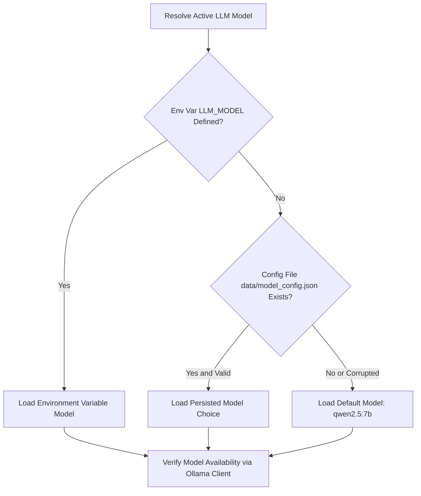

# Configuration Reference

Complete reference for environment variables, runtime parameters, and configuration options in **Gist**.

---

## Environment Variables

Environment variables are passed to the FastAPI backend at startup or defined in a `.env` file in the project root.

| Variable | Type | Default Value | Description |
| --- | --- | --- | --- |
| `OLLAMA_HOST` | String | `http://localhost:11434` | Base URL of the local Ollama server instance. |
| `LLM_MODEL` | String | `qwen2.5:7b` | Primary Ollama chat model name. |
| `FALLBACK_MODEL` | String | `llama3.2:3b` | Lightweight model fallback for low-resource hardware. |
| `EMBEDDING_MODEL` | String | `nomic-embed-text:latest` | Ollama model used for text chunk vector embeddings. |

---

## Application Settings (`backend/config.py`)

All system defaults are managed by the `Settings` Pydantic model in `backend/config.py`.

### 1. Ingestion & Chunking Parameters
- **`chunk_size`** (`int`, default: `600`): Maximum character length of each text chunk extracted from PDFs.
- **`chunk_overlap`** (`int`, default: `100`): Overlap length in characters between adjacent chunks to maintain context boundaries.

### 2. Retrieval & RAG Parameters
- **`top_k_retrieval`** (`int`, default: `3`): Number of most similar document chunks retrieved per question.
- **`max_predict_tokens`** (`int`, default: `400`): Maximum token generation limit per LLM response.
- **`rag_temperature`** (`float`, default: `0.2`): Sampling temperature for Q&A responses (low value enforces strict factual grounding).
- **`quiz_temperature`** (`float`, default: `0.6`): Sampling temperature for quiz generation (higher value promotes question variety).
- **`keep_alive`** (`str`, default: `"30m"`): Duration string passed to Ollama to keep loaded models resident in RAM/VRAM.

### 3. Storage & Path Definitions
- **`chroma_persist_dir`** (`str`): Path to ChromaDB persistent vector storage (`data/chroma`).
- **`collection_name`** (`str`, default: `"exam_buddy_collection"`): Name of the ChromaDB collection.
- **`sqlite_db_path`** (`str`): Path to SQLite metrics database (`data/tracker.db`).
- **`upload_dir`** (`str`): Directory for stored source PDFs (`data/uploads`).

---

## Model Selection Precedence Hierarchy

Gist resolves the active chat model at startup using a strict three-tier evaluation chain:

1. **Environment Variable**: `LLM_MODEL` takes top precedence if defined.
2. **Persisted Choice**: If `LLM_MODEL` is unset, Gist reads `data/model_config.json` (written whenever `/models/select` is called).
3. **Hardcoded Default**: If no file or environment variable exists, `qwen2.5:7b` is loaded.
