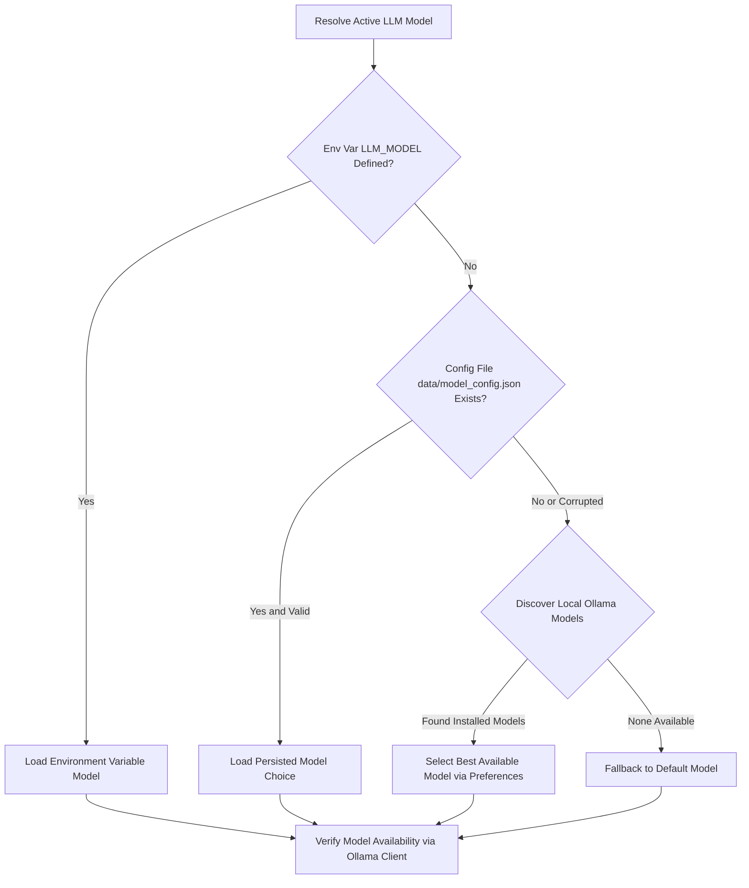

# Configuration Reference

Complete reference for environment variables, runtime parameters, and model configuration in **Gist**.

---

## Environment Variables

Environment variables can be passed to the FastAPI backend at startup or defined in a `.env` file in the project root.

| Variable | Type | Default Value | Description |
| --- | --- | --- | --- |
| `OLLAMA_HOST` | String | `http://localhost:11434` | Base URL of the local Ollama server instance. |
| `LLM_MODEL` | String | `gemma2:9b` (or `qwen2.5:7b`) | Primary chat and quiz generation model. |
| `FALLBACK_MODEL` | String | `llama3.2:3b` | Lightweight model fallback for resource-constrained hardware. |
| `EMBEDDING_MODEL` | String | `nomic-embed-text:latest` | Ollama model used for text chunk vector embeddings. |

---

## Application Settings (`backend/config.py`)

All core system parameters are defined in the `Settings` class in `backend/config.py`.

### 1. Ingestion & Chunking Parameters
- **`chunk_size`** (`int`, default: `600`): Maximum character length of each text chunk extracted from PDFs.
- **`chunk_overlap`** (`int`, default: `100`): Overlap length in characters between adjacent chunks to maintain context continuity.

### 2. Retrieval & RAG Parameters
- **`top_k_retrieval`** (`int`, default: `3`): Number of most similar document chunks retrieved per question.
- **`max_predict_tokens`** (`int`, default: `400`): Maximum token generation limit per LLM response.
- **`rag_temperature`** (`float`, default: `0.2`): Low sampling temperature for Q&A to enforce strict factual adherence.
- **`quiz_temperature`** (`float`, default: `0.6`): Moderate sampling temperature for quiz generation to ensure question diversity.
- **`keep_alive`** (`str`, default: `"30m"`): Duration string passed to Ollama to keep loaded models resident in memory.

### 3. Storage & Path Definitions
- **`chroma_persist_dir`** (`str`): Path to ChromaDB persistent vector storage (`data/chroma`).
- **`collection_name`** (`str`, default: `"exam_buddy_collection"`): Name of the ChromaDB collection.
- **`sqlite_db_path`** (`str`): Path to SQLite database storing questions, papers, and mastery (`data/tracker.db`).
- **`upload_dir`** (`str`): Directory for stored source PDFs (`data/uploads`).
- **`MODEL_CONFIG_PATH`** (`str`): Path to persisted model configuration (`data/model_config.json`).

---

## Dynamic Model Selection Precedence

Gist dynamically resolves which chat model to load at startup using a three-tier evaluation chain:

1. **Environment Variable**: If `LLM_MODEL` is set in the shell environment, it takes top precedence.
2. **Persisted Choice**: If unset, Gist checks `data/model_config.json` (written whenever `/models/select` is called).
3. **Dynamic Discovery**: If no saved configuration exists, Gist queries the local Ollama instance and selects the best installed model based on preference ordering (evaluating Gemma 2, Llama, Mistral, Phi, DeepSeek, and Qwen variants).

---

## Supported Open-Weight Models Preference Order

When resolving available models dynamically (`backend/ingest.py`), Gist checks local installations against the following preference order:

- **Google Gemma 2**: `gemma2:27b`, `gemma2:9b`, `gemma2:2b`, `gemma2`
- **Meta Llama**: `llama3.3`, `llama3.1:70b`, `llama3.1:8b`, `llama3.2:3b`, `llama3.2:1b`, `llama3`
- **Mistral**: `mistral-nemo`, `mistral:7b`, `mistral`
- **Microsoft Phi**: `phi4`, `phi3.5`, `phi3`
- **DeepSeek**: `deepseek-r1:32b`, `deepseek-r1:14b`, `deepseek-r1:8b`, `deepseek-r1:7b`
- **Qwen**: `qwen2.5:32b`, `qwen2.5:14b`, `qwen2.5:7b`, `qwen2.5`
- **Embedding Models**: `nomic-embed-text`, `bge-m3`, `bge-large`, `mxbai-embed-large`
