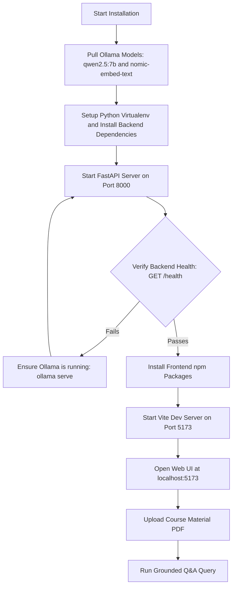

# Tutorial: Getting Started with Gist

This tutorial guides you step-by-step through setting up and running **Gist** on your local machine for the first time. By the end of this tutorial, you will have a running local instance of Gist with an indexed PDF document and execute your first grounded AI query.

---

## Prerequisites

Before beginning, ensure your environment meets the following requirements:

- **Ollama**: Downloaded and running locally (`http://localhost:11434`). Download from [ollama.com](https://ollama.com).
- **Python**: Version `3.10` or higher.
- **Node.js**: Version `18.x` or higher and `npm`.

---

## Setup Workflow



---

## Step 1: Download Required Ollama Models

Gist uses Ollama to execute both text embedding and generation locally. Open your terminal and pull the default models:

```bash
# Download the primary chat LLM (7B parameters)
ollama pull qwen2.5:7b

# Download the vector embedding model
ollama pull nomic-embed-text:latest
```

> **Note for 8 GB RAM machines:** You can pull `llama3.2:3b` as a lightweight chat model:
> ```bash
> ollama pull llama3.2:3b
> ```

---

## Step 2: Set Up and Launch the FastAPI Backend

1. Navigate to the project root directory:
   ```bash
   cd gist
   ```

2. Create and activate a Python virtual environment:
   ```bash
   python3 -m venv .venv
   source .venv/bin/activate
   ```

3. Install backend dependencies:
   ```bash
   pip install fastapi uvicorn pymupdf chromadb sqlite3 pydantic ollama
   ```

4. Start the FastAPI server:
   ```bash
   uvicorn backend.main:app --reload --port 8000
   ```

5. Confirm the backend is running by opening `http://localhost:8000/health` in your browser. You should see:
   ```json
   {
     "status": "healthy",
     "ollama_status": "connected",
     "active_model": "qwen2.5:7b"
   }
   ```

---

## Step 3: Set Up and Launch the React Frontend

1. Open a new terminal tab/window and navigate to the `frontend` directory:
   ```bash
   cd frontend
   ```

2. Install Node package dependencies:
   ```bash
   npm install
   ```

3. Start the Vite development server:
   ```bash
   npm run dev
   ```

4. Open `http://localhost:5173` in your web browser to access the Gist web UI.

---

## Step 4: Perform Your First Grounded Q&A

Now that Gist is running, verify the end-to-end workflow:

1. **Upload Course Material**:
   - In the web interface, navigate to the **Documents** or **Upload** section.
   - Upload any sample PDF study material (e.g., lecture notes or syllabus) and assign a topic (e.g., *Computer Science*).
   - Wait for the indexing confirmation showing chunk counts.

2. **Ask a Question**:
   - Go to the **Q&A / Chat** tab.
   - Type a question related to your uploaded document content.
   - Observe the streamed response along with exact page-level source citations (e.g., `[Source: lecture1.pdf, Page: 4]`).

3. **Generate a Test Quiz**:
   - Navigate to the **Quiz** section, select your topic, and click **Generate Quiz**.
   - Answer the generated questions to verify quiz grading and mastery tracking.

---

## Next Steps

Congratulations! You have completed the Gist setup tutorial. 
- To customize configuration, explore the [Configuration Reference](configuration.md).
- To perform administrative tasks, see the [How-To Guides](how-to-guides.md).
- To understand the internal retrieval architecture, view [System Architecture](architecture.md).
