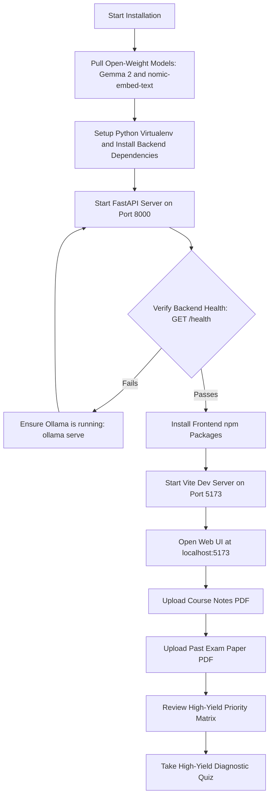

# Tutorial: Getting Started with Gist

This tutorial guides you step-by-step through setting up and running **Gist** on your local machine for the first time. By the end of this tutorial, you will have a running local instance of Gist powered by local open-weight models, index a course document, analyze a past question paper, inspect the High-Yield Priority Matrix, and generate your first exam-targeted quiz.

---

## Prerequisites

Before beginning, ensure your environment meets the following requirements:

- **Ollama**: Downloaded and running locally (`http://localhost:11434`). Download from [ollama.com](https://ollama.com).
- **Python**: Version `3.10` or higher.
- **Node.js**: Version `18.x` or higher and `npm`.

---

## Setup Workflow



---

## Step 1: Download Recommended Open-Weight Models

Gist works with any local model available in Ollama. We recommend **Google Gemma 2** for its balance of reasoning accuracy and speed.

Open your terminal and pull the models:

```bash
# Recommended primary chat model: Google Gemma 2 (9B parameters)
ollama pull gemma2:9b

# Recommended embedding model for vector search
ollama pull nomic-embed-text:latest
```

> **Note for 8 GB RAM systems:** If your machine has 8 GB of RAM or lacks a dedicated GPU, pull the lightweight Gemma 2 or Llama 3.2 models instead:
> ```bash
> # 2B Gemma model (runs smoothly on lightweight hardware)
> ollama pull gemma2:2b
> 
> # Alternatively, Meta Llama 3.2 3B
> ollama pull llama3.2:3b
> ```

---

## Step 2: Set Up and Launch the FastAPI Backend

1. Navigate to the project root directory:
   ```bash
   cd gist
   ```

2. Create and activate a Python virtual environment:
   ```bash
   python3 -m venv .venv
   source .venv/bin/activate
   ```

3. Install backend dependencies:
   ```bash
   pip install fastapi uvicorn pymupdf chromadb sqlite3 pydantic ollama
   ```

4. Start the FastAPI server:
   ```bash
   uvicorn backend.main:app --reload --port 8000
   ```

5. Confirm the backend is running by opening `http://localhost:8000/health` in your browser. You should receive a status response confirming the Ollama connection:
   ```json
   {
     "status": "healthy",
     "ollama_status": "connected",
     "active_model": "gemma2:9b",
     "models_available": ["gemma2:9b", "nomic-embed-text:latest"]
   }
   ```

---

## Step 3: Set Up and Launch the React Frontend

1. Open a new terminal window and navigate to the `frontend` directory:
   ```bash
   cd frontend
   ```

2. Install Node package dependencies:
   ```bash
   npm install
   ```

3. Start the Vite development server:
   ```bash
   npm run dev
   ```

4. Open `http://localhost:5173` in your web browser. Gist will load with its default dark-mode workbench.

---

## Step 4: Perform Your First End-to-End Study Workflow

Verify both the note RAG engine and the exam intelligence engine:

1. **Upload Course Study Material**:
   - Go to the **Documents** section.
   - Upload a syllabus or lecture note PDF (for example, *DBMS Chapter 1*) and assign a subject name (such as *DBMS*).
   - Once processed, notice the chunk count and extracted page index.

2. **Run a Grounded Q&A Query**:
   - Go to the **Q&A** screen.
   - Ask a question based on your uploaded material.
   - Observe the streamed response with exact page citations (for example, `[Source: DBMS_Chapter1.pdf, Page: 4]`).

3. **Upload a Previous Year's Question Paper**:
   - Navigate to the **Past Papers** tab.
   - Upload a previous exam paper PDF (for example, *DBMS 2023 Final Exam*).
   - Gist will extract the questions, detect marks allocations, and tag questions by subtopic.

4. **Inspect the Exam Priority Matrix**:
   - In the **Priority Matrix** view, examine the topic yield analysis.
   - Observe how topics worth high exam marks are highlighted.

5. **Generate a High-Yield Targeted Quiz**:
   - Navigate to the **Quiz** section, select your subject, and toggle **Focus on High-Yield Weak Spots**.
   - Complete the quiz. Gist grades your answers immediately, updates your topic mastery scores in SQLite, and dynamically updates the Priority Matrix to reflect your progress.

---

## Next Steps

Congratulations! You now have a complete, private, offline study partner running locally.
- To learn how to switch models or manage subjects, view the [How-To Guides](how-to-guides.md).
- To explore configuration options, read the [Configuration Reference](configuration.md).
- To understand the underlying algorithms and math, see [System Architecture](architecture.md).
