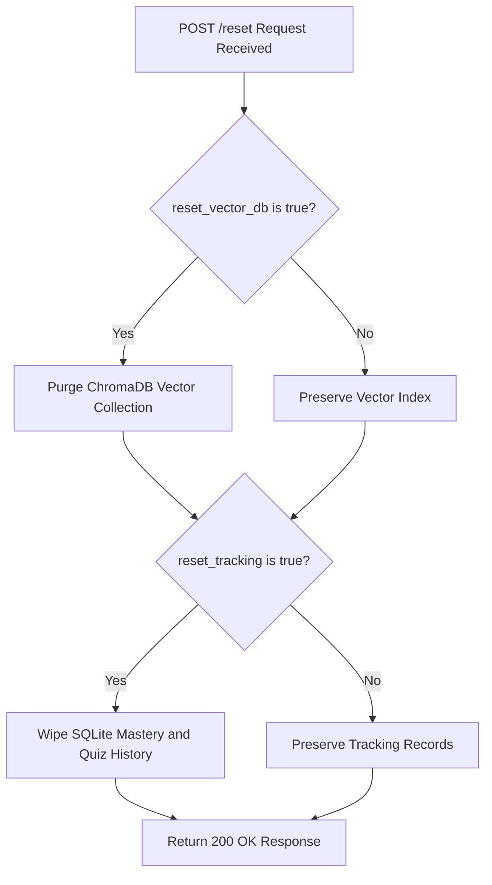
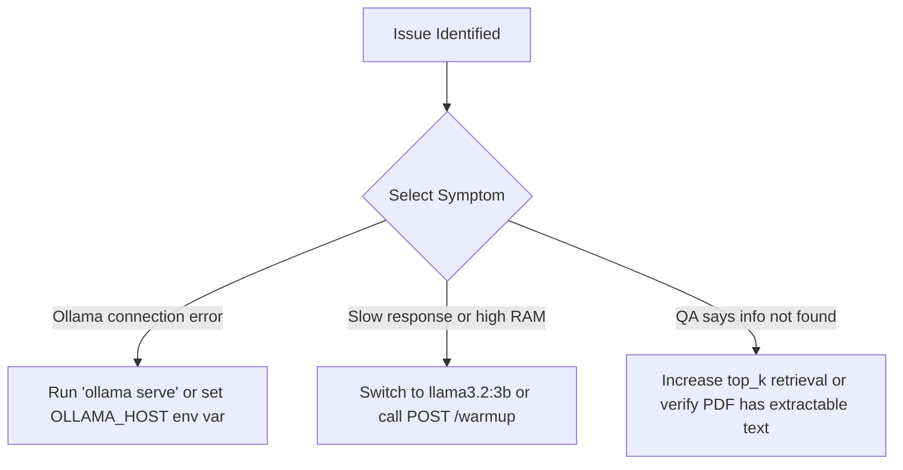

# How-To Guides

This section provides practical, task-oriented recipes to help you operate, configure, and troubleshoot **Gist**.

---

## 1. How to Switch Active LLM Models

Gist allows you to switch between any Ollama models installed on your machine without restarting the server.

### Option A: Via REST API
Send a `POST` request to `/models/select`:

```bash
curl -X POST "http://localhost:8000/models/select" \
     -H "Content-Type: application/json" \
     -d '{"model": "llama3.2:3b"}'
```

The server will validate that the model is installed, switch the active runtime model, and persist your choice to `data/model_config.json`.

### Option B: Via Environment Variable
Override the default model at startup by setting `LLM_MODEL`:

```bash
export LLM_MODEL="llama3.2:3b"
uvicorn backend.main:app --reload --port 8000
```
> **Note:** Explicitly passing `LLM_MODEL` in your shell environment overrides any persisted selection in `data/model_config.json`.

---

## 2. How to Manage Documents and Subject Collections

### Delete a Specific Document
To remove a single PDF document and all its associated vector embeddings from ChromaDB:

```bash
curl -X DELETE "http://localhost:8000/documents/lecture1.pdf"
```

### Delete an Entire Topic/Subject
To remove all documents and quiz statistics for a specific topic (e.g., *Physics*):

```bash
curl -X DELETE "http://localhost:8000/subjects/Physics"
```

---

## 3. How to Reset Mastery Tracking and Vector Databases

If you want to clear your data and start fresh, use the reset endpoint.



### Reset Vector DB Only (Keep Quiz History)
```bash
curl -X POST "http://localhost:8000/reset?reset_vector_db=true&reset_tracking=false"
```

### Reset Quiz Mastery History Only (Keep Indexed Documents)
```bash
curl -X POST "http://localhost:8000/reset?reset_vector_db=false&reset_tracking=true"
```

### Complete System Wipe
```bash
curl -X POST "http://localhost:8000/reset?reset_vector_db=true&reset_tracking=true"
```

---

## 4. How to Tune Text Chunking Parameters

If your course materials contain dense formulas or lengthy paragraphs, tuning the text splitter parameters in `backend/config.py` can improve retrieval accuracy.

1. Open `backend/config.py`.
2. Modify `chunk_size` and `chunk_overlap`:
   ```python
   # Smaller chunks for concise factual QA
   chunk_size: int = 400
   chunk_overlap: int = 80
   ```
3. Re-ingest your documents so they are re-chunked and re-indexed into ChromaDB.

---

## 5. How to Troubleshoot Common Issues



### Issue: `ollama_status: error` in `/health`
- **Cause**: Ollama daemon is not running or running on a non-default port.
- **Solution**: Start Ollama in a terminal:
  ```bash
  ollama serve
  ```
  If Ollama is hosted on a custom host/port, set `OLLAMA_HOST`:
  ```bash
  export OLLAMA_HOST="http://127.0.0.1:11434"
  ```

### Issue: High Memory / Slow Response Times
- **Cause**: 7B models can be slow on integrated GPUs or machines with $\le 8\text{ GB}$ RAM.
- **Solution**: Switch to `llama3.2:3b` or trigger the warmup endpoint (`POST /warmup`) to keep models resident in RAM:
  ```bash
  curl -X POST "http://localhost:8000/warmup"
  ```

### Issue: Q&A Answers Say "Information not found"
- **Cause**: Context chunk retrieval failed or `top_k_retrieval` is too low.
- **Solution**: Increase `top_k` when submitting `/ask` requests (e.g., `"top_k": 5`) or verify the uploaded PDF is text-readable (not scanned raster images without OCR).
