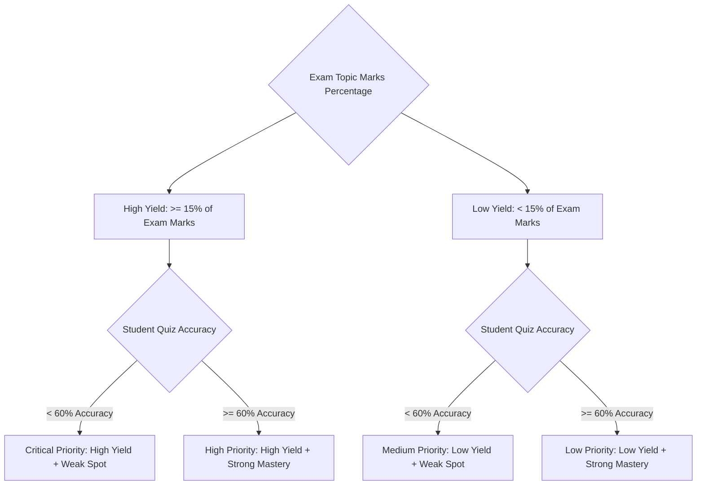
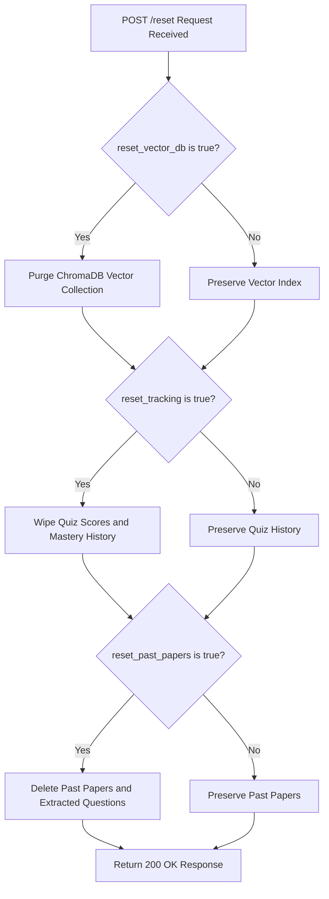
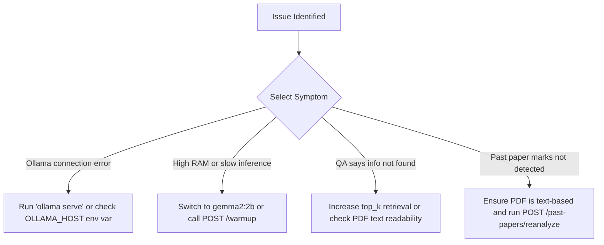

# How-To Guides

This section provides practical, task-oriented recipes to help you operate, configure, and troubleshoot **Gist**.

---

## 1. How to Dynamically Switch Active LLM Models

Gist automatically detects all chat models installed in your local Ollama runtime and lets you switch between them at any time without restarting the server.

You can use any open-weight model, including **Google Gemma 2**, **Meta Llama 3.2**, **Mistral**, **Microsoft Phi-4**, **DeepSeek-R1**, or **Qwen 2.5**.

### Option A: Via REST API
Send a `POST` request to `/models/select` with your chosen model name:

```bash
# Switch to Google Gemma 2 (9B)
curl -X POST "http://localhost:8000/models/select" \
     -H "Content-Type: application/json" \
     -d '{"model": "gemma2:9b"}'

# Or switch to a lightweight model for lower RAM
curl -X POST "http://localhost:8000/models/select" \
     -H "Content-Type: application/json" \
     -d '{"model": "gemma2:2b"}'
```

The server verifies the model is installed in Ollama, switches the active runtime model, and persists your choice to `data/model_config.json`.

### Option B: Via Environment Variable
You can set a default model at startup by defining `LLM_MODEL`:

```bash
export LLM_MODEL="gemma2:9b"
uvicorn backend.main:app --reload --port 8000
```

> **Note:** An explicit `LLM_MODEL` environment variable overrides any persisted selection in `data/model_config.json`.

---

## 2. How to Run Timed Mock Exam Simulations ("Grill Me" Mode)

The Mock Exam Simulator reproduces real examination pressure with timed multi-topic question sets and multi-mark allocations.

### Option A: Using Preset Exam Tiers
Fetch the standard exam presets:

```bash
curl -X GET "http://localhost:8000/exam/presets"
```

Presets include:
- **Quick Grill** (`sprint`): 15 minutes, 25 total marks, 5 targeted questions.
- **Standard Mock** (`standard`): 30 minutes, 50 total marks, 8 balanced questions.
- **Finals Marathon** (`comprehensive`): 60 minutes, 100 total marks, 15 comprehensive questions.

### Option B: Generating a Custom Mock Exam
Generate a tailored exam with specific time limits and mark totals:

```bash
curl -X POST "http://localhost:8000/exam/generate" \
     -H "Content-Type: application/json" \
     -d '{
       "subject": "DBMS",
       "duration_minutes": 45,
       "total_marks": 75,
       "num_questions": 10,
       "use_high_yield": true,
       "fast_mode": false
     }'
```

Submit student answers for itemized grading:

```bash
curl -X POST "http://localhost:8000/exam/submit" \
     -H "Content-Type: application/json" \
     -d '{
       "exam_id": "exam_uuid_here",
       "answers": [
         {"question_id": "q1", "student_answer": "Option B"},
         {"question_id": "q2", "student_answer": "Normalization eliminates anomalies by decomposing relations..."}
       ]
     }'
```

---

## 3. How to Use Fast Mode for Instant Question Generation

By default, Gist authors fresh AI questions tailored to your notes. If you need instant generation under 100ms, enable `fast_mode`:

```bash
curl -X POST "http://localhost:8000/quiz/generate" \
     -H "Content-Type: application/json" \
     -d '{
       "topic": "DBMS",
       "num_questions": 5,
       "fast_mode": true
     }'
```

Fast Mode draws pre-extracted, verified questions directly from your past-paper question archive in SQLite without making LLM generation calls.

---

## 4. How to Inspect Past Quiz Attempts and Topic History

Gist records detailed logs for every quiz attempt.

### Inspect a Specific Quiz Attempt
```bash
curl -X GET "http://localhost:8000/quiz/attempts/quiz_attempt_id_here"
```
Returns student answers, correct options, examiner remarks, and individual question scores.

### Review All Questions for a Topic
```bash
curl -X GET "http://localhost:8000/topics/Normalization/history"
```
Returns historical questions asked under *Normalization* with previous answers and feedback.

---

## 5. How to Upload and Analyze Past Exam Question Papers

Gist can ingest previous years' question papers to build an automated exam question bank with marks detection.

```bash
curl -X POST "http://localhost:8000/past-papers/upload" \
     -F "files=@DBMS_2023_Final.pdf" \
     -F "topic=DBMS" \
     -F "year=2023"
```

The engine:
1. Extracts question items and detects question marks using regex and language model heuristics.
2. Tags each question with a specific concept topic.
3. Indexes the raw text into ChromaDB in the background for note cross-referencing.
4. Stores the structured question items in SQLite for query filtering and priority analysis.

### Re-analyzing Stored Papers
To re-run topic categorization and marks extraction across existing stored papers:

```bash
curl -X POST "http://localhost:8000/past-papers/reanalyze"
```

---

## 6. How to Interpret and Act on the Exam Priority Matrix

The Exam Priority Matrix cross-references past paper topic weightages with your quiz mastery scores.

```bash
curl -X GET "http://localhost:8000/past-papers/priority-matrix?subject=DBMS"
```

### Priority Classification Rules



- **Critical Priority**: Topics that frequently appear in exams with high marks weightage, but where your quiz accuracy is below 60%. Study these first.
- **High Priority**: High-mark topics where you currently perform well, requiring periodic revision.
- **Medium Priority**: Infrequently tested topics where mastery is low.
- **Low Priority**: Infrequently tested topics with high mastery.

---

## 7. How to Isolate Study Materials with Subject Segregation

Gist supports full subject segregation, keeping distinct courses (such as *Database Systems* and *Operating Systems*) completely separate.

### Filter Past Papers by Subject
```bash
curl -X GET "http://localhost:8000/past-papers?subject=DBMS"
```

### Browse Questions for a Specific Subject
```bash
curl -X GET "http://localhost:8000/past-papers/questions?subject=DBMS&limit=50"
```

### Delete an Entire Subject
To remove all lecture notes, vector chunks, and quiz tracking records for a subject:
```bash
curl -X DELETE "http://localhost:8000/subjects/DBMS"
```

---

## 8. How to Reset System Data

Gist provides granular controls to reset different data stores independently.



### Reset Vector Database Only
```bash
curl -X POST "http://localhost:8000/reset?reset_vector_db=true&reset_tracking=false&reset_past_papers=false"
```

### Reset Past Papers Only
```bash
curl -X POST "http://localhost:8000/reset?reset_vector_db=false&reset_tracking=false&reset_past_papers=true"
```

### Complete System Wipe
```bash
curl -X POST "http://localhost:8000/reset?reset_vector_db=true&reset_tracking=true&reset_past_papers=true"
```

---

## 9. How to Tune Text Chunking Parameters

If your study materials contain dense mathematical formulas or lengthy code blocks, tuning the text splitter parameters in `backend/config.py` can improve retrieval precision.

1. Open `backend/config.py`.
2. Adjust `chunk_size` and `chunk_overlap`:
   ```python
   # Smaller chunks for concise factual QA
   chunk_size: int = 400
   chunk_overlap: int = 80
   ```
3. Re-ingest your documents so new embeddings are calculated and stored in ChromaDB.

---

## 10. How to Troubleshoot Common Issues



### Issue: `ollama_status: error` in `/health`
- **Cause**: Ollama daemon is not running or is configured on a non-standard port.
- **Solution**: Start Ollama in your terminal:
  ```bash
  ollama serve
  ```
  If running on a custom host or port, set `OLLAMA_HOST`:
  ```bash
  export OLLAMA_HOST="http://127.0.0.1:11434"
  ```

### Issue: High Memory Consumption or Slow Responses
- **Cause**: Larger models (9B+) can experience latency on systems with unified memory below 16 GB.
- **Solution**: Switch to `gemma2:2b` or `llama3.2:3b`, or call `POST /warmup` to keep model weights pre-loaded in memory:
  ```bash
  curl -X POST "http://localhost:8000/warmup"
  ```

### Issue: Questions Extracted Without Marks
- **Cause**: The PDF question paper might use unusual formatting or is an image scan.
- **Solution**: Verify the PDF text is selectable. You can re-run the extraction heuristics using `POST /past-papers/reanalyze`.
